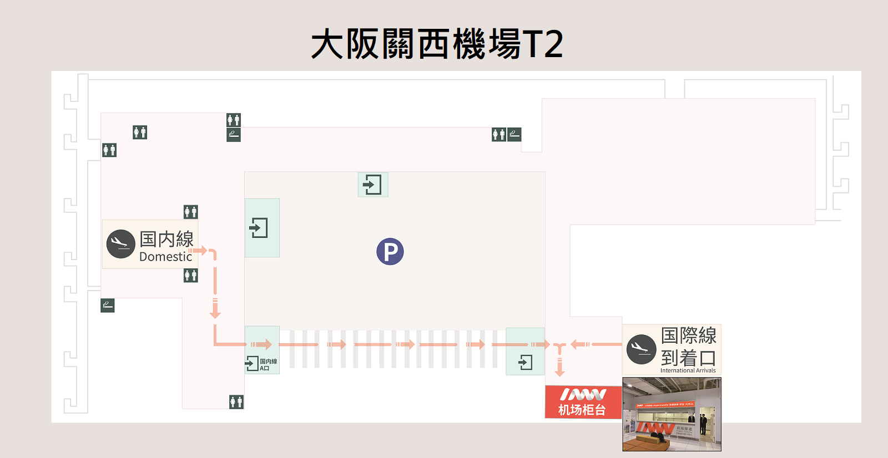
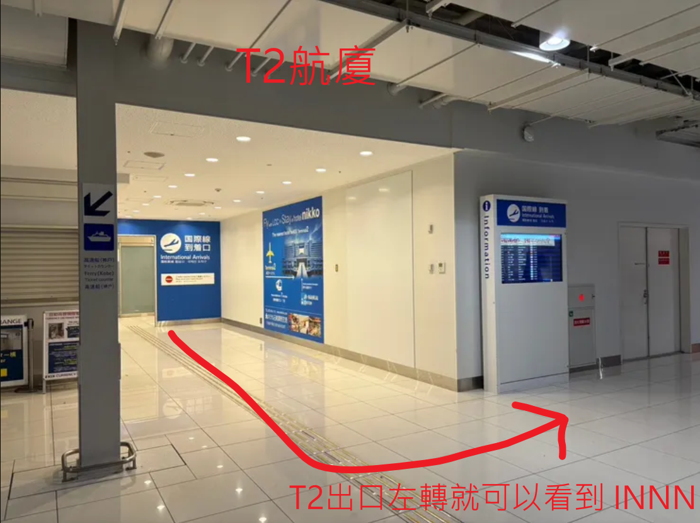
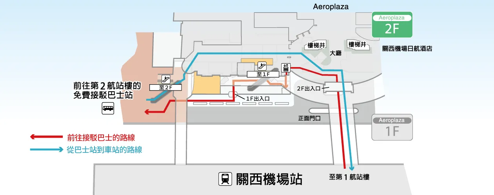
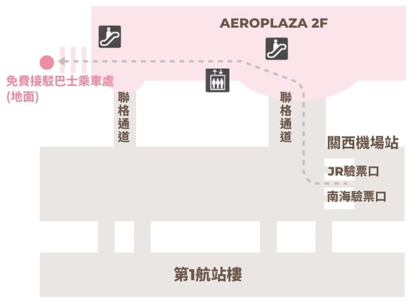
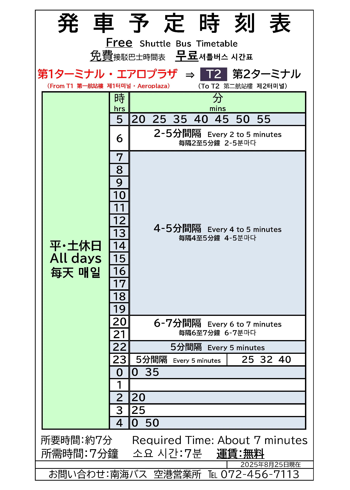
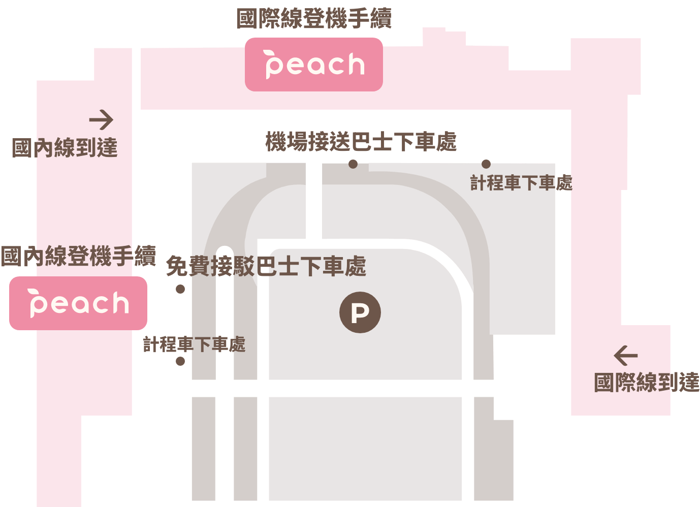

# 2026 大阪獨旅 06/18 ~ 06/21

> 更新日期: 2026-06-15 23:28

---

## 出發前待辦清單

- [x] 手機辦好 ICOCA 卡
- [x] [Visit Japan Web](https://services.digital.go.jp/zh-cmn-hant/visit-japan-web/)
- [x] [出國登錄](https://www.boca.gov.tw/sp-abre-main-1.html)
- [x] 辦理 e-SIM (DJB)
- [x] 準備清水寺門票現金 (500日圓)
- [x] 購買大阪城電子票 (Trip.com)

- [x] 確認 INNN 接駁車訂單（2026-1588\*\*\*）
- [x] 確認 Peach MM028 電子登機證
- [x] 換日幣 / 確認海外刷卡手續費
- [x] 下載 Google Maps 大阪離線地圖
- [x] 下載 Google 翻譯日文離線包
- [x] 下載日本計程車 GO App 並綁定信用卡（清水寺備用方案）

## Day 1：6/18（四）—— 深夜抵達

| 時間       | 活動 / 地點                                                                            | 備註                                                                                                                                                                  | 待辦               |
| ---------- | -------------------------------------------------------------------------------------- | --------------------------------------------------------------------------------------------------------------------------------------------------------------------- | ------------------ | --- |
| 18:15      | [桃園 T1](https://maps.app.goo.gl/dzmAMSbdhjswSMUd6) 搭乘 MM028 起飛                   | ✔ 航班：MM028 (樂桃) T1                                                                                                                                               | 預訂編號：`KTK***` |     |
| 22:00      | 抵達 [關西機場 T2](https://maps.app.goo.gl/5Zq5tejrX3wrYNDW9)，辦理入境 / 領行李       | ⚠️ 入境審查 20–60 分鐘浮動，遇高峰請多預留時間                                                                                                                        |                    |
| 22:30 左右 | INNN 接駁專車（訂單 2026-1588\*\*\*）→ 前往市區                                        | 出關後依序：➞ 前往 INNN 櫃台核對（T2 國際線到達口左側黃色沙發區）➞ 等候接駁（每 30 分一班，發車前 10 分在櫃台集合） ⚠️ 若錯過會順延至下一班；櫃台營業：07:00–00:10 |                    |
| 23:30 左右 | 抵達 [東橫INN大阪日本橋文樂劇場前](https://maps.app.goo.gl/fTt5JfTcHRqiNL1A8) 辦理入住 | 視出關與等車時間而定 ✔ 預訂確認碼：5581.**_._** (PIN: \*\*\*\*)                                                                                                    |                    |
| 深夜       | [道頓堀](https://maps.app.goo.gl/bvfxbKrwDbBgiV23A)                                    | ❌ 不需預約／僅人多                                                                                                                                                   | 宵夜：待選         |

### 🏨 住宿確認資訊

1. **飯店與聯絡資訊**
   - 東橫INN 大阪日本橋文樂劇場前 (東横INN大阪日本橋文楽劇場前)
   - 地址：[Chuo-ku Nipponbashi 1-13-2, Chuo Ward, Osaka, 542-0073, 日本](https://maps.app.goo.gl/fTt5JfTcHRqiNL1A8) (中央区日本橋1-13-2)
   - 電話：+81 6 7668 4045
2. **入住與退房時間**
   - 入住：6/18（四）15:00 起
   - 退房：6/20（六）10:00 前（共 2 晚）
   - ⚠️ 特殊要求：已向飯店告知預計於 23:00~00:00 (深夜 0 點) 之間辦理入住
3. **房型與費用**
   - 雙人房－禁菸 (1 間客房，房價包含早餐)
   - 現場付款金額：JPY 15,978 (約 TWD 3,153，不含城市稅)
4. **預訂與個人資訊**
   - 預訂確認碼：5581.**_._** / PIN 碼：\*\*\*\*
   - 住客姓名：S*** H*** H*** / 電子信箱：o***@gmail.com

### ✈️ 機票確認資訊

- **航空公司**：樂桃航空 (Peach)
- **預訂編號**：`KTK***`
- **航班細節**：
  - **去程 (MM028)**：6/18（四）18:15 台北桃園 (T1) ➔ 22:00 大阪關西 (T2)
  - **回程 (MM023)**：6/21（日）07:50 大阪關西 (T2) ➔ 09:55 台北桃園 (T1)
- **乘客人數**：2 人訂單，但**僅限 S\*** H**\*\*\*** 獨自出發** (另一旅客 H\*** Y**\*\*\*** 未同行)
- **託運行李**：1 件 (S**\* H**\*\*\*\*\* 加購 1 件)
- **聯絡人資訊**：H**\* Y**\*\***_ / 信箱 `i_**@gmail.com`/ 電話`0928\*\*\*397`

### 🚗 接機服務確認資訊

- **服務項目**：日本-INNN機場交通 | 關西機場往返大阪市區（單程接機）
- **訂單編號**：`2026-1588***`（聯繫客服單號：`P2026031318******`）
- **乘車人數**：1 人 (旅客姓名：施\*勲)
- **班機時間**：6/18（四）22:00 抵達之 MM028 航班
- **乘車指引**：
  - 出關後前往 **T2 國際線到達口左側黃色沙發區** 的 INNN 櫃台核對資訊。
  - 出示訂購憑證之 QR Code 進行核銷乘車。
  - 行李規定：免費攜帶 1 件 32 吋行李箱（三邊和 < 170cm）與 1 件 20 吋登機箱（三邊和 < 115cm）。
  - 下車地點：東橫INN大阪日本橋文樂劇場前。

### ⚠️ INNN 接駁風險與應對

1. **入境 + 領行李超過 60 分** → 可能錯過某班並順延
   - 建議在飛機上先打開 INNN 確認訊息、記下櫃台位置與營業時間；若預期要等較久，心理先預期等下一班

2. **超額行李無法登車** → 現場因空間不足被退件
   - 建議出發前確認行李件數與尺寸，若有大件行李請事先加購行李券或聯絡業者確認車種

3. **深夜不熟櫃台位置→浪費時間**
   - 建議把櫃台位置（T2 國際線到達口左側黃色沙發區）截圖存入手機；飛機上先查好到達口路線，出關後直接前往櫃台核對/確認

---

## Day 2：6/19（五）—— 京都一日遊

| 時間  | 活動 / 地點                                                                                                                                                                                                                                                                                                           | 備註                                                                                                                                                                                                                                                                                                                                                                                                                                                                                                                                                      | 待辦                                                              |
| ----- | --------------------------------------------------------------------------------------------------------------------------------------------------------------------------------------------------------------------------------------------------------------------------------------------------------------------- | --------------------------------------------------------------------------------------------------------------------------------------------------------------------------------------------------------------------------------------------------------------------------------------------------------------------------------------------------------------------------------------------------------------------------------------------------------------------------------------------------------------------------------------------------------- | ----------------------------------------------------------------- |
| 07:00 | 從 [日本橋](https://maps.app.goo.gl/kCabn4TkMCpc28f2A?q=34.6669677,135.5061197) 2 番月台搭堺筋線（往北千里）→ [淡路](https://maps.app.goo.gl/vTQwZzBUuwFVaGxd9?q=34.7393654,135.5169941) 換阪急京都線特急 → [烏丸](https://www.google.com/maps/search/?api=1&query=烏丸站&q=35.0036744,135.7605895)（約 55 分，¥650） | 刷 ICOCA 即可，無需買紙票（搭乘一般自由座車廂即可，第 4 節為 PRiVACE 指定席，其餘車廂皆為自由座） | 前往京都並在烏丸下車，步行 10 分鐘至咖啡廳                        |
| 08:00 | [INODA咖啡 本店](https://maps.app.goo.gl/vpBvQCnQtD7jsNk69)                                                                                                                                                                                                                                                           | 08:00–08:50 用餐 🚗 **早餐後至清水寺銜接方案：** • **Plan A (207 公車)：** 於 [四條高倉公車站](https://maps.app.goo.gl/92Qkp99nk13GCpje9?q=35.0037313,135.7616107) 搭乘 207 路至 [清水道公車站](https://maps.app.goo.gl/V9BbPGyWTHi9db199?q=34.9965046,135.7768302) 下車，步行 750 公尺上坡至仁王門。 • **Plan B (計程車備案)：** 若時間落後，使用 **GO App** 叫車直達 [清水寺](https://maps.app.goo.gl/Kv3RuMopX8dmE4Cg8?q=34.9946662,135.784661) 仁王門（可直接載到門口，避開 Plan A 最累的 12 分鐘上坡路段） ⚠️ 需提前下載 GO App 以防萬一 | 早餐：[INODA咖啡 本店](https://maps.app.goo.gl/vpBvQCnQtD7jsNk69) |
| 09:15 | [清水寺](https://maps.app.goo.gl/iyK9fv1AT5nYJVXx5?q=34.9946662,135.784661)                                                                                                                                                                                                                                           | ⚠️ 趁人少；選「二年坂往上拍」清水舞台視角最佳                                                                                                                                                                                                                                                                                                                   | ✔ 可提前購買電子票避免排隊                                        |
| 11:00 | [二寧坂](https://maps.app.goo.gl/uoMtMkpQHuZc43J9A) / [三年坂](https://maps.app.goo.gl/74xPSBCa5ovELvNT9?q=34.9966644,135.781008) ➞ [花見小路](https://maps.app.goo.gl/mR8HnRpf8NuKE4mP8?q=35.0014922,135.7746403) 散步                                                                                               | 從三年坂走下來後，往西北方向步行約 10-15 分鐘即可抵達花見小路，先欣賞古色古香的茶屋建築（不安排大餐，避免與下午漢堡排衝突）                                                                                                                                                                                                                                     |                                                                   |
| 13:00 | [八坂神社 西樓門](https://maps.app.goo.gl/Gbyrfude4JBfyX78A?q=35.0037437,135.7775306)                                                                                                                                                                                                                                 | 花見小路走到盡頭就是四條通，右轉步行不到 5 分鐘即抵達八坂神社正門（西樓門）                                                                                                                                                                                                                                                                                     |                                                                   |
| 13:40 | 祇園散步吃東西：[GION GOZU 四条店](https://maps.app.goo.gl/ZwnESJTGKBdykDGY6?q=35.0036644,135.7762665) ➞ [鳴門鯛燒本舖](https://maps.app.goo.gl/wLq1fBpu3CZv3WiE8?q=35.003997,135.772745) ➞ [京都漢堡排 Conel](https://maps.app.goo.gl/227vkH3jeeyYBCiL8?q=35.0042233,135.7706292)                                    | 從八坂神社往西（往鴨川/車站方向）沿著四條通走，順路吃回車站：布丁 ➞ 鯛魚燒 ➞ 漢堡排，完全不走回頭路                                                                                                                                                                                                                                                             | 點心：布丁、鯛魚燒 下午餐：漢堡排                              |
| 15:30 | 至 [祇園四條站](https://maps.app.goo.gl/5BAJeMgCNPaT6YPs8?q=35.0033014,135.7719122) 搭乘京阪本線前往 [伏見稻荷站](https://maps.app.goo.gl/4V97VPTXq3NBCk2A8?q=34.9687187,135.7693455)                                                                                                                                 | 步行與車程約 10 分鐘，刷 ICOCA 即可                                                                                                                                                                                                                                                                                                                             |                                                                   |
| 15:50 | [伏見稻荷大社](https://maps.app.goo.gl/Hp9iJ5RnUasTqLrv5)                                                                                                                                                                                                                                                             | 從大鳥居開始進去；⚠️ 建議往鳥居深處走（遠離入口人少出片）；6 月梅雨季建議帶折疊傘                                                                                                                                                                                                                                                                               |                                                                   |
| 17:30 | 搭京阪返回大阪                                                                                                                                                                                                                                                                                                        | ⚠️ 預留 5–10 分鐘容錯緩衝；直接刷 ICOCA 進出站即可，無須買紙票（搭乘一般自由座車廂即可，第 6 節為 Premium Car 指定席，其餘車廂皆為自由座）。從 [伏見稻荷站](https://maps.app.goo.gl/4V97VPTXq3NBCk2A8?q=34.9687187,135.7693455)（京阪本線普通/準急）→ [丹波橋站](https://maps.app.goo.gl/EytrhYxPTbmms9tP8)內換乘同線特急列車（往大阪方向）→ [北濱站](https://maps.app.goo.gl/ZHWQPQmYiGVjqgau7)下車，站內轉乘地鐵堺筋線（北濱 K14）→ 搭至 [日本橋](https://maps.app.goo.gl/kCabn4TkMCpc28f2A?q=34.6669677,135.5061197)（K17） |                                                                   |
| 18:30 | 抵達大阪 [日本橋](https://maps.app.goo.gl/kCabn4TkMCpc28f2A?q=34.6669677,135.5061197)                                                                                                                                                                                                                                 |                                                                                                                                                                                                                                                                                                                                                                 |                                                                   |
| 19:00 | [國產牛燒肉 炙屋 千日前店](https://maps.app.goo.gl/AYEhoJYJF8h29Pf29) 晚餐                                                                                                                                                                                                                               | ⚠️ 熱門排隊店且無法線上單人預約。建議 18:30 抵達日本橋後，先步行前往餐廳（難波3-4-16 ECS第32大樓4F）登記候位或抽號碼牌，再回飯店放行李休息，避免現場站立久候。 ✔ 現場可點「國產牛吃到飽方案」 | 晚餐：國產牛燒肉 炙屋（現場排隊） |

### 去程路線：日本橋 → 烏丸（NAVITIME 確認版）

| 段次 | 路線                                                              | 出發地 / 上車站                                                                        | 目的地 / 下車站                                                                         | 時間     | 費用 |
| ---- | ----------------------------------------------------------------- | -------------------------------------------------------------------------------------- | --------------------------------------------------------------------------------------- | -------- | ---- |
| 1    | OsakaMetro 堺筋線（往北千里）→ 直通阪急千里線（同車廂，坐著不動） | [日本橋](https://maps.app.goo.gl/kCabn4TkMCpc28f2A?q=34.6669677,135.5061197) 2 番月台  | [淡路](https://maps.app.goo.gl/vTQwZzBUuwFVaGxd9?q=34.7393654,135.5169941)              | 約 17 分 | ¥240 |
| 2    | 阪急京都線特急（往京都河原町）                                    | [淡路](https://maps.app.goo.gl/vTQwZzBUuwFVaGxd9?q=34.7393654,135.5169941) 2・3 番月台 | [烏丸](https://www.google.com/maps/search/?api=1&query=烏丸站&q=35.0036744,135.7605895) | 約 30 分 | ¥410 |

**總計：約 55 分鐘（不含步行）　¥650　換乘 1 次（淡路站換月台）**

> ✔ 上車前確認車頭方向牌寫「北千里」或「高槻市」，兩個都會經過淡路

> ✔ 全程刷 ICOCA，不需買紙票（搭乘自由座車廂即可，不需預約指定席。第 4 節為 PRiVACE 指定席，其餘車廂均為自由座）

### 回程路線：京都河原町 → 日本橋飯店

| 段次 | 路線                                        | 出發地 / 上車站                                                                                         | 目的地 / 下車站                                                                                         | 時間     | 備註             |
| ---- | ------------------------------------------- | ------------------------------------------------------------------------------------------------------- | ------------------------------------------------------------------------------------------------------- | -------- | ---------------- |
| 1    | 阪急京都線特急（往大阪梅田）                | [京都河原町](https://maps.app.goo.gl/APvfnTQbSnzSSRsQA)                                                 | [淡路](https://maps.app.goo.gl/vTQwZzBUuwFVaGxd9?q=34.7393654,135.5169941)                              | 約 35 分 |                  |
| 2    | 阪急千里線 → 直通堺筋線（同車廂，坐著不動） | [淡路](https://maps.app.goo.gl/vTQwZzBUuwFVaGxd9?q=34.7393654,135.5169941)                              | [日本橋](https://maps.app.goo.gl/kCabn4TkMCpc28f2A?q=34.6669677,135.5061197)（K17）                     | 約 20 分 |                  |
| 3    | 步行                                        | [日本橋](https://maps.app.goo.gl/kCabn4TkMCpc28f2A?q=34.6669677,135.5061197)（K17）                     | [道頓堀](https://maps.app.goo.gl/JfTtUShoXsFDNsLaA) / [難波](https://maps.app.goo.gl/6BJv4MGhXyZNv2daA) | 約 10 分 | 吃晚餐逛街       |
| 4    | 步行                                        | [道頓堀](https://maps.app.goo.gl/JfTtUShoXsFDNsLaA) / [難波](https://maps.app.goo.gl/6BJv4MGhXyZNv2daA) | [日本橋飯店](https://maps.app.goo.gl/fTt5JfTcHRqiNL1A8)                                                 | 約 8 分  | 逛完後步行回飯店 |

**總計：約 55 分鐘（不含逛街）　換乘 1 次（淡路站換月台）**

> ✔ 全程刷 ICOCA，不需買紙票（搭乘自由座車廂即可，不需預約指定席。第 4 節為 PRiVACE 指定席，其餘車廂均為自由座）

---

## Day 3：6/20（六）—— 購物馬拉松：電電街 ➔ 百貨大採購

| 時間        | 活動 / 地點                                                                                                               | 備註                                                                                                                                                                                                                                                                                                            | 待辦                                                             |
| ----------- | ------------------------------------------------------------------------------------------------------------------------- | --------------------------------------------------------------------------------------------------------------------------------------------------------------------------------------------------------------------------------------------------------------------------------------------------------------- | ---------------------------------------------------------------- |
| 08:00       | 起床                                                                                                                      | 整理行李，準備退房                                                                                                                                                                                                                                                                                              |                                                                  |
| 08:30       | 退房並寄放行李                                                                                                            | 行李寄放於「東橫INN 大阪日本橋文樂劇場前」櫃台（⚠️ 需確認飯店同意寄放至 19:30）                                                                                                                                                                                                                                 |                                                                  |
| 08:45–10:00 | [黑門市場](https://maps.app.goo.gl/8v35E7K7y1N1)                                                                          | 步行前往，完成早午餐；吃快一點就能收掉（ex: 明石燒）                                                                                                                                                                                                                                                            | 早午餐：待選（邊走邊吃）                                         |
| 10:00       | 交通：黑門市場 ➞ 大阪城                                                                                                   | 堺筋線（日本橋 ➞ [堺筋本町](https://maps.app.goo.gl/qGbYpBdXChLRxotX9)）➞ 站內轉乘中央線（➞ [谷町四丁目車站](https://maps.app.goo.gl/wux2cBwcoCqNQr2C7)（走樓梯 · 從9出站））➞ 步行至大阪城（約 30 分，¥190）                                                                                                   | 刷 ICOCA 即可                                                    |
| 10:30–12:30 | [大阪城](https://maps.app.goo.gl/tB9Agj857Rj2F3va7)                                                                       | ❌ 公園免費開放　天守閣 9:00–18:00（最晚入場 17:30）　跑完唯一較遠的景點；提早出發可避開中午最熱與最擠的登天守閣人潮                                                                                                                                                                                            |                                                                  |
| 12:30       | 交通：大阪城 ➞ 電器街                                                                                                     | 步行至 [森之宮](https://maps.app.goo.gl/diD9Mw19MSaHp5F78) ➞ 搭中央線（➞ 堺筋本町）➞ 站內轉乘堺筋線（➞ [惠美須町](https://maps.app.goo.gl/z8Et7FF39bbqNARg8)）➞ 步行至[電器街](https://maps.app.goo.gl/Vp8Szq7hudPXo1878)（約 37 分，¥240）                                                                     | 刷 ICOCA 即可                                                    |
| 13:00–15:00 | [日本橋電器街](https://maps.app.goo.gl/Vp8Szq7hudPXo1878) / [千日前道具屋筋](https://maps.app.goo.gl/5gokAdbwdQ4Sp1gC6)   | ❌ 不需預約　從惠美須町站出發，由南往北逛回飯店方向，採買模型或電器                                                                                                                                                                                                                                             | 逛街：電器 / 模型 / 廚具                                         |
| 15:00–18:00 | **[難波](https://maps.app.goo.gl/6BJv4MGhXyZNv2daA)百貨與釣具大採購**                                                           | 步行至 [高島屋](https://maps.app.goo.gl/FZJJxx5jNE9AviDo6)、[Namba Parks](https://maps.app.goo.gl/ZfReR9W9E2CEvvZ2A) 或 [難波CITY 本館](https://maps.app.goo.gl/Lst1Jbs3hmwBf7577)，順道前往 [Edion 愛電王 難波總店](https://maps.app.goo.gl/4bxavCUCPaJaqNo16) 採購模型電器，並可前往 [Fishing Max Namba](https://maps.app.goo.gl/Vz6Uwe3uEUPRQVSa6) 採購釣具。⚠️ 請預留充足的退稅手續時間 | 專櫃退稅、日系服飾、電器模型、釣具用品採購                                 |
| 18:00–19:15 | **最後晚餐**                                                                                                              | 於 [難波站](https://maps.app.goo.gl/6BJv4MGhXyZNv2daA)周邊或百貨內用餐，避免人擠人，保存體力，且離飯店較近                                                                                                                                                                                                      | 晚餐：待選（建議吃好）                                           |
| 19:15–19:30 | 回飯店取行李                                                                                                              | 從 [難波](https://maps.app.goo.gl/6BJv4MGhXyZNv2daA)步行回飯店提領行李，確保在飯店櫃台要求的時間前領回                                                                                                                                                                                                          | 取回寄放行李                                                     |
| 19:30–19:50 | **大廳戰利品裝箱**                                                                                                        | 於飯店大廳整理行李，將下午採購的模型、衣物等戰利品塞入大行李箱，確保能順利關上                                                                                                                                                                                                                                  | 整理戰利品進大行李箱                                             |
| 19:50–20:10 | 交通：前往 [南海難波站](https://maps.app.goo.gl/VDgx7G3ZTtAmHUNN8)                                                        | 從飯店步行前往 [南海難波站](https://maps.app.goo.gl/VDgx7G3ZTtAmHUNN8)（約 1.1 公里，負重移動預留 20 分鐘以保安全）                                                                                                                                                                                             | 步行前往 [南海難波站](https://maps.app.goo.gl/VDgx7G3ZTtAmHUNN8) |
| 20:10       | 交通：[難波](https://maps.app.goo.gl/6BJv4MGhXyZNv2daA) ➞ 關西機場                                                        | 從 [南海難波站](https://maps.app.goo.gl/VDgx7G3ZTtAmHUNN8) 搭乘南海電鐵空港急行（約 44 分鐘，¥970）前往關西機場                                                                                                                                                                                                 | 刷 ICOCA 即可                                                    |
| 21:00 左右  | 抵達 [關西機場站](https://maps.app.goo.gl/8zbuZeHNSWzNMvFZ6)，前往 [Aeroplaza](https://maps.app.goo.gl/ppZCDxsuGTNFmJL88) | 關西機場站與 [Aeroplaza](https://maps.app.goo.gl/ppZCDxsuGTNFmJL88) 為相連動線，準備前往 2F NODOKA                                                                                                                                                                                                              |                                                                  |
| 21:00–05:15 | [NODOKA](https://maps.app.goo.gl/QWkiNYRwmSsQ7LHn7) 洗澡／休息／整理行李                                                  | **關鍵行動**：抵達 [Aeroplaza](https://maps.app.goo.gl/ppZCDxsuGTNFmJL88) 2F 的 NODOKA，優先排隊洗澡並休息；24 小時營業，使用 ICOCA 或卡片付費                                                                                                                                                                  |                                                                  |

### 交通路線：黑門市場 → 大阪城

| 段次 | 路線                                               | 出發地 / 上車站                                                                               | 目的地 / 下車站                                                                | 時間             | 費用             |
| ---- | -------------------------------------------------- | --------------------------------------------------------------------------------------------- | ------------------------------------------------------------------------------ | ---------------- | ---------------- |
| 1    | 步行                                               | [黑門市場](https://maps.app.goo.gl/zKjNxecm8j4Rrny89)                                         | [日本橋站](https://maps.app.goo.gl/kCabn4TkMCpc28f2A?q=34.6669677,135.5061197) | 約 4 分 (220m)   |                  |
| 2    | OsakaMetro 堺筋線普通（往北千里）                  | [日本橋站](https://maps.app.goo.gl/kCabn4TkMCpc28f2A?q=34.6669677,135.5061197) 2 番月台 (K17) | [堺筋本町站](https://maps.app.goo.gl/qGbYpBdXChLRxotX9)                        | 約 3 分 (2站)    | ¥190 (包含段次3) |
| 3    | 站內轉乘中央線，搭乘中央線普通（往學研奈良登美丘） | [堺筋本町站](https://maps.app.goo.gl/qGbYpBdXChLRxotX9) 1 番月台 (C17)                        | [谷町四丁目站](https://maps.app.goo.gl/wux2cBwcoCqNQr2C7)                      | 約 1 分 (1站)    |                  |
| 4    | 步行                                               | [谷町四丁目站](https://maps.app.goo.gl/wux2cBwcoCqNQr2C7) (C18)                               | [大阪城](https://maps.app.goo.gl/tB9Agj857Rj2F3va7)                            | 約 19 分 (1.3km) |                  |

**總計：約 30 分鐘（乘車 24 分鐘）　¥190　換乘 1 次（堺筋本町站站內轉乘）**

> ✔ 黑門市場到地鐵站步行僅 220 公尺
> ✔ 在堺筋本町站換乘中央線僅需步行約 1 分鐘，非常方便
> ✔ 從 [谷町四丁目站](https://maps.app.goo.gl/wux2cBwcoCqNQr2C7)（走樓梯 · 從9出站）至大阪城天守閣步行約 19 分鐘 (約 1.3 公里)，全程刷 ICOCA 即可

### 交通路線：大阪城 → 電器街

| 段次 | 路線                                         | 出發地 / 上車站                                                        | 目的地 / 下車站                                             | 時間             | 費用             |
| ---- | -------------------------------------------- | ---------------------------------------------------------------------- | ----------------------------------------------------------- | ---------------- | ---------------- |
| 1    | 步行                                         | [大阪城](https://maps.app.goo.gl/tB9Agj857Rj2F3va7)                    | [森之宮站](https://maps.app.goo.gl/diD9Mw19MSaHp5F78) (C19) | 約 19 分 (1.4km) |                  |
| 2    | OsakaMetro 中央線普通（往夢洲）              | [森之宮站](https://maps.app.goo.gl/diD9Mw19MSaHp5F78) 3 番月台 (C19)   | [堺筋本町站](https://maps.app.goo.gl/qGbYpBdXChLRxotX9)     | 約 4 分 (2站)    | ¥240 (包含段次4) |
| 3    | 站內轉乘堺筋線，搭乘堺筋線普通（往天下茶屋） | [堺筋本町站](https://maps.app.goo.gl/qGbYpBdXChLRxotX9) 1 番月台 (K15) | [惠美須町站](https://maps.app.goo.gl/z8Et7FF39bbqNARg8)     | 約 5 分 (3站)    |                  |
| 4    | 步行                                         | [惠美須町站](https://maps.app.goo.gl/z8Et7FF39bbqNARg8) (K18)          | [日本橋電電街](https://maps.app.goo.gl/Vp8Szq7hudPXo1878)   | 約 6 分 (500m)   |                  |

**總計：約 37 分鐘（乘車 26 分鐘）　¥240　換乘 1 次（堺筋本町站站內轉乘）**

> ✔ 從大阪城天守閣步行至 [森之宮站](https://maps.app.goo.gl/diD9Mw19MSaHp5F78) 約 1.4 公里，可沿途欣賞大阪城公園綠地
> ✔ 堺筋本町站轉乘僅需步行約 1 分鐘
> ✔ 全程刷 ICOCA 即可

---

## Day 4：6/21（日）—— 滿載而歸

| 時間        | 活動 / 地點                                                                                                                        | 備註                                                                                                                                                                                  | 待辦 |
| ----------- | ---------------------------------------------------------------------------------------------------------------------------------- | ------------------------------------------------------------------------------------------------------------------------------------------------------------------------------------- | ---- |
| 04:15–04:30 | 收拾、離開 [NODOKA](https://maps.app.goo.gl/QWkiNYRwmSsQ7LHn7)                                                                     | 早餐：可在便利商店或 NODOKA 隨手帶解決                                                                                                                                                |      |
| 04:30–04:57 | [Aeroplaza](https://maps.app.goo.gl/ppZCDxsuGTNFmJL88) 1F 搭免費接駁車前往第二航廈 [T2](https://maps.app.goo.gl/5Zq5tejrX3wrYNDW9) | 免費接駁車車程約 7 分鐘；出關西機場站驗票口右轉，穿過 [Aeroplaza](https://maps.app.goo.gl/ppZCDxsuGTNFmJL88) 下至 1F 前方 4 時班次：04:00 / 04:50（搭 04:50 班，約 04:57 抵達 T2） |      |

| 05:00–07:00 | 第二航廈 [T2](https://maps.app.goo.gl/5Zq5tejrX3wrYNDW9) 辦理 Peach 報到／託運行李／安檢前準備 | ⚠️ Peach 國際線報到時間為起飛前 120 至 50 分鐘，07:00 截止報到（極重要，逾時無法登機） 報到櫃台：T2 1F，接駁車下車後左側入口進入。先至 BAGGAGE TAG KIOSK 列印行李條，再前往行李託運處 ⚠️ 安檢截止：07:25 前必須通過安全檢查（起飛前 25 分鐘） ✔ 約 05:00 抵達排隊，預留充足的託運與安檢時間 ✔ 航班：MM023 (樂桃) T2 | 預訂編號：`KTK***` | 託運行李：1 件 | ✔ 07:00 前完成報到手續 |

| 07:50 | 起飛 | 抵達台北桃園 T1 (09:55) | |

---

# 📌 必要行動

| 優先度               | 行動                                                      |
| -------------------- | --------------------------------------------------------- |
| ✔ 強烈建議           | 準備清水寺門票現金 (500日圓，現場購票)                    |
| ✔ 強烈建議 (已完成)  | 大阪城電子票 (已透過 Trip.com 購買)                       |
| ✔ 行為策略（最重要） | NODOKA → 一到機場直接去排（這是唯一會真的影響你流程的點） |

---

# 🧠 bottleneck

唯一真正的 bottleneck 是 **機場淋浴資源競爭**，
其次才是 **觀景台黃金時段流量控制**。

---

# 🎒 攜帶物品清單 (Packing List)

- **🛂 證件與貴重物品**
  - [ ] 護照正本（確認效期）
  - [ ] 日幣現金 & 海外刷卡信用卡
  - [ ] 機票、飯店與接送確認單（紙本或存手機）
- **🔋 3C 與隨身電器**
  - [ ] 手機與充電線
  - [ ] 行動電源 (必須隨身登機)
  - [ ] e-SIM QR Code 或安裝說明
- **👕 衣物盥洗與生活**
  - [ ] 換洗衣物兩天份 (短袖、內著、襪子等)
  - [ ] 折疊雨傘 (6月梅雨季必備)
  - [ ] 個人盥洗用品與小保養品
  - [ ] 電動刮鬍刀
  - [ ] 乳液
- **💊 常用藥品與雜物**
  - [ ] 安眠藥
  - [ ] 衛生紙
  - [ ] 打火機 (⚠️ 僅限隨身攜帶 1 個)
