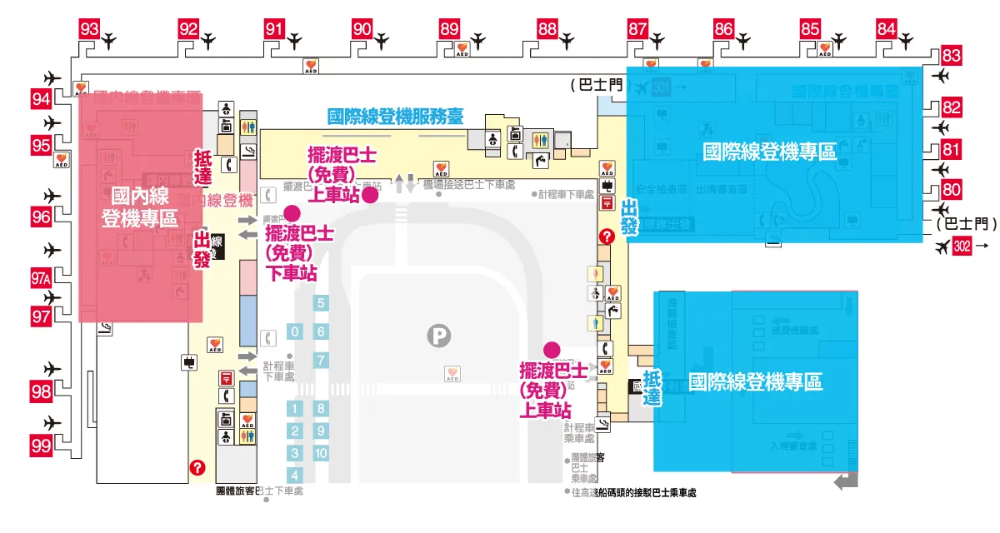

# 2026 大阪獨旅 06/18 ~ 06/21

> 更新日期: 2026-05-26 19:50

---

## 出發前待辦清單

- [x] 手機辦好 ICOCA 卡
- [ ] [Visit Japan Web](https://services.digital.go.jp/zh-cmn-hant/visit-japan-web/)
- [ ] [出國登錄](https://www.boca.gov.tw/sp-abre-main-1.html)
- [ ] 辦理 e-SIM
- [ ] 購買清水寺電子票
- [ ] 購買大阪城電子票
- [x] 確認 INNN 接駁車訂單（2026-1588178）
- [ ] 確認 Peach MM028 電子登機證
- [x] 換日幣 / 確認海外刷卡手續費
- [ ] 下載 Google Maps 大阪離線地圖
- [ ] 下載 Google 翻譯日文離線包

## Day 1：6/18（四）—— 深夜抵達

| 時間       | 活動 / 地點                                  | 備註                                                                                                                                                                  | 待辦       |
| ---------- | -------------------------------------------- | --------------------------------------------------------------------------------------------------------------------------------------------------------------------- | ---------- |
| 18:15      | [桃園 T1](https://maps.app.goo.gl/dzmAMSbdhjswSMUd6) 搭乘 MM028 起飛                      |                                                                                                                                                                       |            |
| 22:00      | 抵達 [關西機場 T2](https://maps.app.goo.gl/5Zq5tejrX3wrYNDW9)，辦理入境 / 領行李           | ⚠️ 入境審查 20–60 分鐘浮動，遇高峰請多預留時間                                                                                                                        |            |
| 22:30 左右 | INNN 接駁專車（訂單 2026-1588178）→ 前往市區 | 出關後依序：➞ 前往 INNN 櫃台核對（T2 國際線到達口左側黃色沙發區）➞ 等候接駁（每 30 分一班，發車前 10 分在櫃台集合） ⚠️ 若錯過會順延至下一班；櫃台營業：07:00–00:10 |            |
| 23:30 左右 | 抵達 [東橫INN大阪日本橋文樂劇場前](https://maps.app.goo.gl/fTt5JfTcHRqiNL1A8) 辦理入住                             | 視出關與等車時間而定                                                                                                                                                  |            |
| 深夜       | [道頓堀](https://maps.app.goo.gl/bvfxbKrwDbBgiV23A)                                       | ❌ 不需預約／僅人多                                                                                                                                                   | 宵夜：待選 |

### INNN 機場 T2 接機處

### ⚠️ INNN 接駁風險與應對

1. **入境 + 領行李超過 60 分** → 可能錯過某班並順延
   - 建議在飛機上先打開 INNN 確認訊息、記下櫃台位置與營業時間；若預期要等較久，心理先預期等下一班

2. **超額行李無法登車** → 現場因空間不足被退件
   - 建議出發前確認行李件數與尺寸，若有大件行李請事先加購行李券或聯絡業者確認車種

3. **深夜不熟櫃台位置→浪費時間**
   - 建議把櫃台位置（T2 國際線到達口左側黃色沙發區）截圖存入手機；飛機上先查好到達口路線，出關後直接前往櫃台核對/確認

---

## Day 2：6/19（五）—— 京都一日遊

| 時間  | 活動 / 地點                                                                                | 備註                                                                                                                                                       | 待辦                                                |
| ----- | ------------------------------------------------------------------------------------------ | ---------------------------------------------------------------------------------------------------------------------------------------------------------- | --------------------------------------------------- |
| 08:00 | 從 [日本橋](https://maps.app.goo.gl/kCabn4TkMCpc28f2A) 2 番月台搭堺筋線（往北千里）→ [淡路](https://maps.app.goo.gl/vTQwZzBUuwFVaGxd9) 換阪急京都線特急 → [京都河原町](https://maps.app.goo.gl/APvfnTQbSnzSSRsQA)（約 58 分，¥650） | 刷 ICOCA 即可，無需買紙票                                                                                                                                  | 早餐：[丸福珈琲店 千日前本店](https://maps.app.goo.gl/7Ch8e5ETpJLp98x37)（8點營業，出發前解決） |
| 09:00 | 抵達 [京都河原町](https://maps.app.goo.gl/APvfnTQbSnzSSRsQA)                                                                             |                                                                                                                                                            |                                                     |
| 09:15 | [清水寺](https://maps.app.goo.gl/iyK9fv1AT5nYJVXx5)                                                                                     | ⚠️ 趁人少；選「二年坂往上拍」清水舞台視角最佳                                                                                                              | ✔ 可提前購買電子票避免排隊                          |
| 11:00 | [二寧坂](https://maps.app.goo.gl/uoMtMkpQHuZc43J9A) / [三年坂](https://maps.app.goo.gl/74xPSBCa5ovELvNT9)                                                                            |                                                                                                                                                            | 午餐：[奧丹豆腐料理](https://maps.app.goo.gl/6UnmkNvfcn14rcd28) / 三年坂茶寮（建議提前記好店名） |
| 13:00 | [祇園](https://maps.app.goo.gl/C1txvdXBy9ssDLhD6)、[花見小路](https://maps.app.goo.gl/M4rJ6a5v521zZ4ZNA)散步 | | |
| 14:30 | [八坂神社](https://maps.app.goo.gl/wJ5c7b3rL2P6j1aX7) | | |
| 15:15 | 搭京阪前往伏見稻荷 | 從 [祇園四條站](https://maps.app.goo.gl/yC7L9n9uB1Rk5o3X8) 搭乘京阪，約 5 分鐘 | |
| 15:30 | [伏見稻荷大社](https://maps.app.goo.gl/Hp9iJ5RnUasTqLrv5) | 從大鳥居開始進去；⚠️ 建議往鳥居深處走（遠離入口人少出片）；6 月梅雨季建議帶折疊傘 | |
| 17:30 | 搭京阪返回大阪 | ⚠️ 預留 5–10 分鐘容錯緩衝；從 [伏見稻荷站](https://maps.app.goo.gl/6t7oEyFVmsKrTsPK6)（京阪本線普通/準急）→ [丹波橋站](https://maps.app.goo.gl/EytrhYxPTbmms9tP8)內換乘同線特急列車（往大阪方向）→ [北濱站](https://maps.app.goo.gl/ZHWQPQmYiGVjqgau7)下車，站內轉乘地鐵堺筋線（北濱 K14）→ 搭至日本橋（K17） |  |
| 18:30 | 抵達大阪 [日本橋](https://maps.app.goo.gl/kCabn4TkMCpc28f2A)                                                                             |                                                                                                                                                            |                                                     |
| 19:00 | [道頓堀](https://maps.app.goo.gl/JfTtUShoXsFDNsLaA) 晚餐                                                                                 | [串家物語 Namba Parks](https://maps.app.goo.gl/wCm3k29WWo5fgsPK8)（自助炸串，無需預約）                                                                    | 晚餐：待選                                          |

### 去程路線：日本橋 → 京都河原町（NAVITIME 確認版）

| 段次 | 路線                                                              | 上車站           | 下車站     | 時間     | 費用 |
| ---- | ----------------------------------------------------------------- | ---------------- | ---------- | -------- | ---- |
| 1    | OsakaMetro 堺筋線（往北千里）→ 直通阪急千里線（同車廂，坐著不動） | [日本橋](https://maps.app.goo.gl/kCabn4TkMCpc28f2A) 2 番月台  | [淡路](https://maps.app.goo.gl/vTQwZzBUuwFVaGxd9)       | 約 17 分 | ¥240 |
| 2    | 阪急京都線特急（往京都河原町）                                    | [淡路](https://maps.app.goo.gl/vTQwZzBUuwFVaGxd9) 2・3 番月台 | [京都河原町](https://maps.app.goo.gl/APvfnTQbSnzSSRsQA) | 約 35 分 | ¥410 |

**總計：約 58 分鐘　¥650　換乘 1 次（淡路站換月台）**

> ✔ 上車前確認車頭方向牌寫「北千里」或「高槻市」，兩個都會經過淡路

> ✔ 全程刷 ICOCA，不需買紙票

### 回程路線：京都河原町 → 日本橋飯店

| 段次 | 路線                                        | 上車站        | 下車站        | 時間     | 備註             |
| ---- | ------------------------------------------- | ------------- | ------------- | -------- | ---------------- |
| 1    | 阪急京都線特急（往大阪梅田）                | [京都河原町](https://maps.app.goo.gl/APvfnTQbSnzSSRsQA)    | [淡路](https://maps.app.goo.gl/vTQwZzBUuwFVaGxd9)          | 約 35 分 |                  |
| 2    | 阪急千里線 → 直通堺筋線（同車廂，坐著不動） | [淡路](https://maps.app.goo.gl/vTQwZzBUuwFVaGxd9)          | [日本橋](https://maps.app.goo.gl/kCabn4TkMCpc28f2A)（K17） | 約 20 分 |                  |
| 3    | 步行                                        | [日本橋](https://maps.app.goo.gl/kCabn4TkMCpc28f2A)（K17） | [道頓堀](https://maps.app.goo.gl/JfTtUShoXsFDNsLaA) / 難波 | 約 10 分 | 吃晚餐逛街       |
| 4    | 步行                                        | [道頓堀](https://maps.app.goo.gl/JfTtUShoXsFDNsLaA) / 難波 | [日本橋飯店](https://maps.app.goo.gl/fTt5JfTcHRqiNL1A8) | 約 8 分  | 逛完後步行回飯店 |

**總計：約 55 分鐘（不含逛街）　換乘 1 次（淡路站換月台）**

> ✔ 全程刷 ICOCA，不需買紙票

---

## Day 3：6/20（六）—— 南區掃街，機場過夜

| 時間        | 活動 / 地點                                    | 備註                                                                                                   | 待辦                                                                   |
| ----------- | ---------------------------------------------- | ------------------------------------------------------------------------------------------------------ | ---------------------------------------------------------------------- |
| 09:00       | 起床整理、打包行李                             |                                                                                                        |                                                                        |
| 09:45       | 退房，寄放行李                                 |                                                                                                        |                                                                        |
| 10:00–10:45 | [黑門市場](https://maps.app.goo.gl/zKjNxecm8j4Rrny89)                          | ❌ 不需預約　⚠️ 以早午餐為主，吃快一點就能收掉（ex: 明石燒）                                           | 早午餐：待選（邊走邊吃）                                               |
| 11:00–13:00 | [大阪城](https://maps.app.goo.gl/tB9Agj857Rj2F3va7)                            | ❌ 公園免費開放　天守閣 9:00–18:00（最晚入場 17:30）　⚠️ 上天守閣建議抓 1.5–2 小時                     |                                                                        |
| 13:15–14:00 | [日本橋電電街](https://maps.app.goo.gl/qzQ9jbrmuSyZkKLKA) / [千日前道具屋筋](https://maps.app.goo.gl/5gokAdbwdQ4Sp1gC6) | ❌ 不需預約　保持短逛，避免壓縮後面行程                                                                | 逛街：電器 / 模型 / 廚具                                               |
| 14:15–15:15 | [通天閣](https://maps.app.goo.gl/eFswsy7cd3cw8VyA9)                            | ❌ 不需預約　⚠️ 上塔與拍照抓 1 小時較穩                                                                | <b>小食：新世界串炸（待選）</b>                                               |
| 15:30–18:30 | [心齋橋](https://maps.app.goo.gl/pRQToFCrVxBBiFHs7) / [道頓堀](https://maps.app.goo.gl/JfTtUShoXsFDNsLaA) | ❌ 不需預約　⚠️ 人潮極多；購物 / 晚餐留彈性，此段不要壓縮                                              | 逛街：藥妝 / 雜貨 / 伴手禮 晚餐：待選（大阪最後一頓正餐，建議吃好） |
| 20:00       | 回飯店拿行李                                   |                                                                                                        |                                                                        |
| 21:00       | [南海難波站](https://maps.app.goo.gl/VDgx7G3ZTtAmHUNN8)搭南海電鐵空港急行（走南海本線直通機場線）前往關西機場站 | ⚠️ 南海難波站 ≠ 地鐵難波站，需步行前往南海難波站搭車（約 ¥970，44 分）　21:30 出發亦可，21:00 更穩 |  |
| 21:44 左右  | 抵達關西機場站，前往 Aeroplaza | 關西機場站與 Aeroplaza 為相連動線，準備前往 2F NODOKA |  |
| 22:00–05:15 | NODOKA 洗澡／休息／整理行李 | ⚠️ 先看 NODOKA 現場排隊狀況，優先處理淋浴或休息位；NODOKA 位於 Aeroplaza 2F。 ✔ 若淋浴間拖太久，改用 [AEROPLAZA 付費淋浴處](https://maps.app.goo.gl/tvx4kjvycJuiTQYp6)作為備案；與 1F 免費接駁巴士乘車處為同一建築上下樓 |  |

### 機場免費接駁巴士乘車處

---

## Day 4：6/21（日）—— 滿載而歸

| 時間  | 活動 / 地點 | 備註                          | 待辦                     |
| ----- | ----------- | ----------------------------- | ------------------------ |
| 05:15–05:30 | 收拾、離開 NODOKA | 早餐：可在便利商店或 NODOKA 隨手帶解決 |  |
| 05:30–05:45 | Aeroplaza 1F 搭免費接駁車前往第二航廈 T2 | 免費接駁車車程約 7～9 分鐘；乘車處在 Aeroplaza 1F |  |
| 05:45–07:00 | 第二航廈 T2 辦理 Peach 報到／託運行李／安檢前準備 | ⚠️ Peach 國際線報到時間為起飛前 120 至 50 分鐘，07:00 截止報到（極重要，逾時無法登機） ✔ 提早於 05:45 抵達櫃台排隊以預留充足的託運與安檢時間 | ✔ 07:00 前完成報到手續 |
| 07:50 | 起飛        |                               |                          |

---

# 📌 必要行動

| 優先度               | 行動                                                      |
| -------------------- | --------------------------------------------------------- |
| ✔ 強烈建議           | 清水寺電子票（避免排隊）                                  |
| ✔ 強烈建議           | 大阪城電子票（避免排隊）                                  |
| ✔ 行為策略（最重要） | NODOKA → 一到機場直接去排（這是唯一會真的影響你流程的點） |

---

# 🧠 bottleneck

唯一真正的 bottleneck 是 **機場淋浴資源競爭**，
其次才是 **觀景台黃金時段流量控制**。
